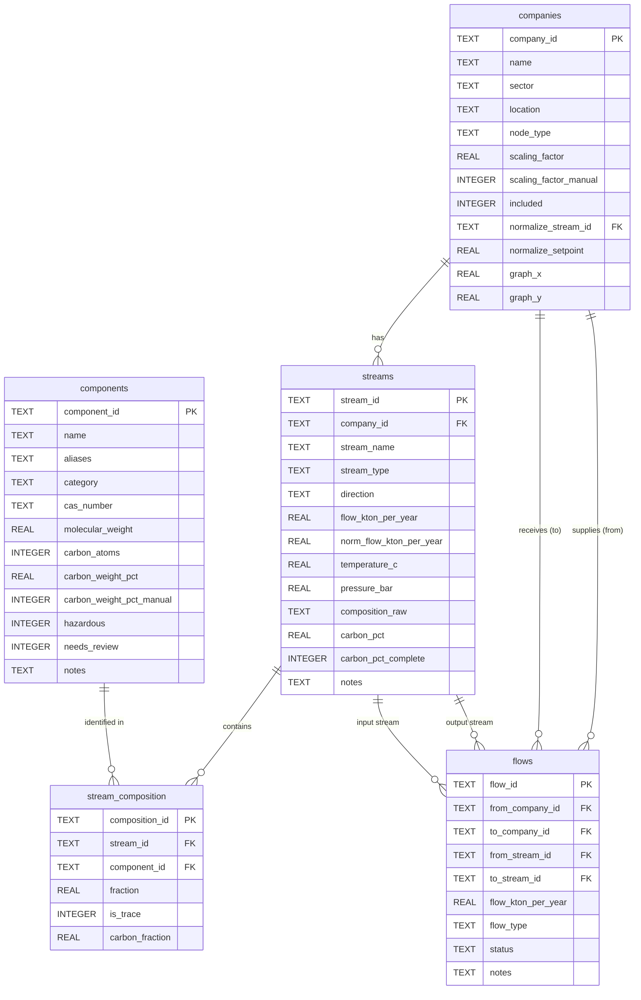

# Data Model

Five tables in total. Companies and streams capture what each company independently consumes and produces. Flows are populated only after matching analysis identifies candidate connections.

---

## Entity Relationship

---

## `companies` — Graph nodes

One row per company **or external node**. Real companies are auto-generated from distinct values in `raw_streams_data.csv` during extraction; external nodes are added manually via the TUI. `sector` and `location` are filled manually afterward.

| Column | Type | Description |
|---|---|---|
| `company_id` | TEXT (PK) | e.g. `C001` |
| `name` | TEXT | Company or node name |
| `sector` | TEXT | Industry sector — filled manually |
| `location` | TEXT | Zone or address — filled manually |
| `node_type` | TEXT | `'company'` (default), `'import_source'`, `'export_sink'`, or `'waste_facility'`. See **External Nodes** below. Added by `migrate_add_external_nodes.py`. |
| `scaling_factor` | REAL | Multiplier (default 1.0) that produces `norm_flow_kton_per_year` from raw flow. **Computed and written by `normalize_streams.py`** — `setpoint / ref_flow` when a reference stream is set, or a manually-entered value when `scaling_factor_manual = 1`. Raw `flow_kton_per_year` is never modified. Added by `migrate_add_company_columns.py`. |
| `scaling_factor_manual` | INTEGER | `1` = use the stored `scaling_factor` directly (manual override); `0` (default) = recompute it from the reference stream / setpoint. Added by `migrate_add_scaling_factor_manual.py`. |
| `included` | INTEGER | `1` = visible in cluster analysis, `0` = excluded. Added by `migrate_add_company_columns.py`. |
| `normalize_stream_id` | TEXT (FK → streams) | Reference stream for per-company normalization. Must be a stream of this company with `flow > 0`. `NULL` = no reference (normalized flow falls back to the raw flow). Added by `migrate_add_normalization.py`. |
| `normalize_setpoint` | REAL | Target value (default 1.0) the reference stream is scaled to. With a reference set, `norm_flow = flow / ref_flow × setpoint`. Added by `migrate_add_normalize_setpoint.py`. |
| `graph_x` | REAL | Saved x position of this node in the web app graph view. `NULL` until the layout is saved. Added by `migrate_add_graph_layout.py`. |
| `graph_y` | REAL | Saved y position of this node in the web app graph view. `NULL` until the layout is saved. Added by `migrate_add_graph_layout.py`. |

---

## `components` — Material/component reference table

Centralizes component identity so that `"SiO2"` and `"silicon dioxide"` resolve to the same row. Pre-populated from `raw_materials_nomenclature.csv`; extended during stream extraction.

| Column | Type | Description |
|---|---|---|
| `component_id` | TEXT (PK) | e.g. `CM001` |
| `name` | TEXT | Canonical name, e.g. `SiO2`, `Fe`, `limestone` |
| `aliases` | TEXT | Comma-separated alternative names / synonyms |
| `category` | TEXT | One of: `oxide`, `metal`, `carbonate`, `sulfate`, `organic`, `named_material`, `other` |
| `cas_number` | TEXT | CAS registry number where applicable |
| `molecular_weight` | REAL | g/mol (NULL for named materials) |
| `carbon_atoms` | INTEGER | Number of carbon atoms (from nomenclature CSV; NULL if unknown) |
| `carbon_weight_pct` | REAL | Carbon weight fraction (0–1). Computed as `(carbon_atoms × 12.011) / molecular_weight`. Can be overridden manually via `carbon.py set-component`. NULL when data is insufficient and no override is set. Added by `migrate_add_carbon.py`. |
| `carbon_weight_pct_manual` | INTEGER | `1` if manually set; prevents `carbon.py recalculate` from overwriting. Added by `migrate_add_carbon.py`. |
| `hazardous` | INTEGER | `1` = hazardous, `0` = not, NULL = unknown |
| `needs_review` | INTEGER | `1` if auto-added during extraction and not yet verified |
| `notes` | TEXT | Optional regulatory or handling notes |

> **Reserved entry:** CM227 is the `"unknown"` component — used to absorb unaccounted composition fractions. It is excluded from `carbon_pct` sums.

> **Lookup during extraction:** the parser resolves component names against both `name` and `aliases`. Unrecognized components are inserted with `needs_review = 1`.

---

## `streams` — Material streams per company

One row per stream per company. `direction` is derived from `stream_type` and makes inflow/outflow queries straightforward without joins.

| Column | Type | Description |
|---|---|---|
| `stream_id` | TEXT (PK) | e.g. `S001` |
| `company_id` | TEXT (FK → companies) | Owning company |
| `stream_name` | TEXT | Name as in source data |
| `stream_type` | TEXT | `raw_material`, `product`, or `waste` |
| `direction` | TEXT | Derived: `input` (raw_material) or `output` (product, waste) |
| `flow_kton_per_year` | REAL | Flow rate in kton/year |
| `norm_flow_kton_per_year` | REAL | `flow_kton_per_year / ref_flow` where `ref_flow` is the company's reference stream. Reference stream's own value is always `1.0`. NULL when no reference set. Added by `migrate_add_normalization.py`. |
| `temperature_c` | REAL | Operating temperature in °C (NULL if not provided) |
| `pressure_bar` | REAL | Operating pressure in bar (NULL if not provided) |
| `composition_raw` | TEXT | Original composition string, preserved for reference |
| `carbon_pct` | REAL | Sum of `carbon_fraction` across all non-trace, non-unknown composition rows. Partial sums accepted. NULL when no eligible components have `carbon_weight_pct`. Added by `migrate_add_carbon.py`. |
| `carbon_pct_complete` | INTEGER | `1` if all non-trace, non-unknown components have `carbon_weight_pct`; `0` if any are missing; NULL if no composition rows. Added by `migrate_add_carbon.py`. |
| `notes` | TEXT | Optional |

---

## `stream_composition` — Junction: streams ↔ components

Each row is one component within one stream. Fractions are stored as decimals (0–1).

| Column | Type | Description |
|---|---|---|
| `composition_id` | TEXT (PK) | e.g. `CP001` |
| `stream_id` | TEXT (FK → streams) | The stream this component belongs to |
| `component_id` | TEXT (FK → components) | The resolved component |
| `fraction` | REAL | Decimal fraction, e.g. `0.60` for 60%. `0` for trace amounts. |
| `is_trace` | INTEGER | `1` if original value was `"trace"`, `0` otherwise |
| `carbon_fraction` | REAL | `fraction × carbon_weight_pct`. NULL when `carbon_weight_pct` is NULL or `is_trace = 1`. Added by `migrate_add_carbon.py`. |

> If non-trace fractions don't sum to 1.0 (±0.02 tolerance), the remainder is recorded as a row pointing to the `"unknown"` component and a warning is logged.

---

## `flows` — Graph edges (proposed/confirmed connections)

Starts **empty**. Populated after matching analysis identifies candidate industrial symbiosis links, or manually via the TUI.

Every flow has exactly **two node endpoints** (`from_company_id` and `to_company_id` are always non-null), preserving the graph invariant for network analysis. Stream references may be NULL when an endpoint is an external node.

| Column | Type | Description |
|---|---|---|
| `flow_id` | TEXT (PK) | e.g. `F001` |
| `from_company_id` | TEXT NOT NULL (FK → companies) | Source node — company or external node |
| `to_company_id` | TEXT NOT NULL (FK → companies) | Destination node — company or external node |
| `from_stream_id` | TEXT nullable (FK → streams) | Output stream being supplied. **NULL** when `from_company_id` is an `import_source`. |
| `to_stream_id` | TEXT nullable (FK → streams) | Input stream being satisfied. **NULL** when `to_company_id` is an `export_sink` or `waste_facility`. |
| `flow_kton_per_year` | REAL | Agreed or estimated quantity |
| `flow_type` | TEXT | `internal`, `import`, `export`, or `waste_to_wmf`. Auto-derived from node types. Added by `migrate_add_external_nodes.py`. |
| `status` | TEXT | `candidate`, `confirmed`, or `rejected` |
| `notes` | TEXT | Optional |

### Flow types

| `flow_type` | From node | To node | Stream NULLs |
|---|---|---|---|
| `internal` | `company` | `company` | Neither NULL |
| `import` | `import_source` | `company` | `from_stream_id` is NULL |
| `export` | `company` | `export_sink` | `to_stream_id` is NULL |
| `waste_to_wmf` | `company` | `waste_facility` | `to_stream_id` is NULL |

---

## External Nodes

External nodes use the same `companies` table but have `node_type != 'company'`. They represent cluster boundary entities:

| `node_type` | Role | Has streams? |
|---|---|---|
| `import_source` | Raw material supplier outside the cluster | Optional — can have output streams if needed |
| `export_sink` | Product buyer outside the cluster | Optional — can have input streams if needed |
| `waste_facility` | Material sink (WMF, landfill, etc.) — outflow not modelled by default | Optional — can have output streams if the WMF re-processes material |

External nodes appear in the graph and have named identities. They are created manually via `+ Add External Node` in the Manage Companies TUI.

**Graph invariant:** Every `flows` row always has two non-null company endpoints. Nulls appear only on the stream-reference side.

---

## Inflows / Outflows vs. Connections

| Concept | Table | Populated when |
|---|---|---|
| What a company consumes | `streams` (direction=`input`) | During extraction |
| What a company produces | `streams` (direction=`output`) | During extraction |
| Who exchanges with whom | `flows` | After matching analysis |
