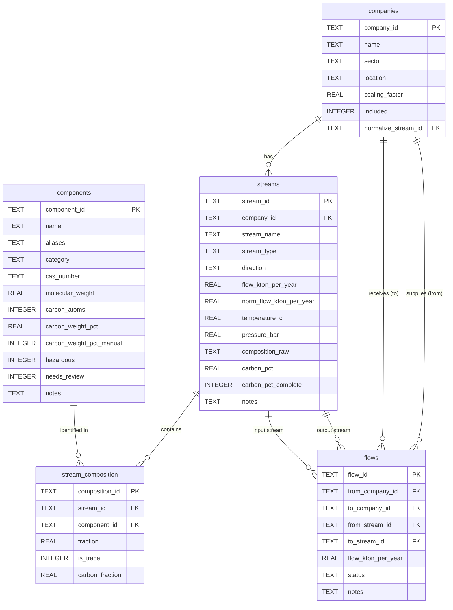

# Industrial Cluster Material Flow Analysis — Project Spec

> Living document. Update as the project evolves. Intended to be passed to Claude Code for implementation.

---

## Project Goal

Extract material flow data from a poorly structured Excel file and organize it into a clean, queryable database. The primary use case is **graph analysis to identify which companies could be connected** based on matching inflows and outflows — i.e. industrial symbiosis matching.

Companies are **not yet connected** in the real world. The `streams` table captures what each company consumes and produces independently. The `flows` table starts empty and is only populated after matching analysis identifies candidate connections.

---

## Source Data

### Primary input: `raw_streams_data.csv`

Instead of parsing the Excel directly, all stream data is manually copied into a single flat CSV file. This avoids the complexity of range-based Excel extraction.

**Delimiter:** semicolon (`;`)

| Column | Description |
|---|---|
| `company` | Company name |
| `stream_type` | One of: `raw`, `product`, `waste` |
| `stream_name` | Name of the material/stream |
| `composition` | Free-text composition string (see [Composition String Parser](#composition-string-parser) for formats) |
| `kiloton/year` | Numeric flow rate in kton/year |
| `Temperature ©` | Operating temperature in °C — **note:** header has a copyright-symbol encoding artefact; `extract.py` matches on any header containing `"temp"` (case-insensitive) |
| `pressure (bar)` | Operating pressure in bar |

> **On `stream_type` mapping:** The CSV uses short labels. These are mapped during extraction:
> - `raw` → `raw_material` (direction: `input`)
> - `product` → `product` (direction: `output`)
> - `waste` → `waste` (direction: `output`)

### Reference input: `raw_materials_nomenclature.csv`

A reference list of known chemical materials. Pre-loaded into the `components` table before stream extraction so that the composition parser can resolve names and aliases against it.

**Delimiter:** semicolon (`;`)
**Rows:** 226 materials

| Column | Description |
|---|---|
| `Chemical` | Canonical name, e.g. `"Carbon black"`, `"cis-2-Butene"`, `"1,1,2-Trichloroethane"` |
| `Abbreviation` | Short name / formula, e.g. `"TECE"`, `"CH4"` |
| `CAS Number` | CAS registry number, e.g. `"630-20-6"` |
| `Molecular weight` | Float, g/mol |
| `Carbon Atoms` | Integer count of carbon atoms in the molecule |

> This file does **not** necessarily cover all materials that appear in stream compositions. During extraction, any unrecognized component is flagged for manual review and added to `components` with `needs_review = 1`.

### Legacy: Excel-based extraction (config.yaml)

The original Excel extraction approach (one sheet per company, cell ranges in `config.yaml`) is documented in Appendix A for reference. It is **not used** in the current pipeline.

---

## Data Model

Five tables in total. The diagram below shows how they relate:



---

### `companies` — One row per company (graph nodes)
| Column | Type | Description |
|---|---|---|
| `company_id` | TEXT (PK) | e.g. `C001` |
| `name` | TEXT | Company name (matches `company` column in CSV) |
| `sector` | TEXT | Industry sector |
| `location` | TEXT | Zone or address |
| `scaling_factor` | REAL | Flow display multiplier (range 0.1–5.0, default 1.0). Applied client-side to kton/year display only — raw DB values are never modified. |
| `included` | INTEGER | Whether the company participates in cluster analysis: `1` = included, `0` = excluded. Excluded companies are hidden in the graph and omitted from candidate display, but their rows and stream data remain in the DB. |
| `normalize_stream_id` | TEXT (FK → streams) | Reference stream for per-company normalization. Must be an `output`-direction stream belonging to this company. `NULL` = normalization disabled. Set and cleared via `normalize_streams.py`. |

> During extraction, companies are auto-generated from distinct values in `raw_streams_data.csv`. The `sector` and `location` fields are left NULL and filled manually afterward. `scaling_factor` and `included` were added via `migrate_add_company_columns.py`. `normalize_stream_id` was added via `migrate_add_normalization.py`.

> **Important:** The backend computes candidates across **all** companies regardless of `included`. Filtering by `included` is done client-side so that toggling a company on does not require a full data re-fetch.

---

### `components` — Reference table for all chemical/material components
Centralizes component identity to avoid duplicate or inconsistent naming (e.g. `"SiO2"` vs `"silicon dioxide"`). Components are registered here once and referenced by ID everywhere else. Pre-populated from `raw_materials_nomenclature.csv` and extended incrementally during stream extraction.

| Column | Type | Description |
|---|---|---|
| `component_id` | TEXT (PK) | e.g. `CM001` |
| `name` | TEXT | Canonical name, e.g. `SiO2`, `Fe`, `limestone` |
| `aliases` | TEXT | Comma-separated alternative names / synonyms |
| `category` | TEXT | e.g. `oxide`, `metal`, `carbonate`, `organic`, `named_material` |
| `cas_number` | TEXT | CAS registry number where applicable |
| `molecular_weight` | REAL | g/mol where applicable (NULL for named materials) |
| `carbon_atoms` | INTEGER | Number of carbon atoms (from nomenclature CSV; NULL if unknown) |
| `carbon_weight_pct` | REAL | Weight fraction of carbon in the component (0–1 scale). Computed as `(carbon_atoms × 12.011) / molecular_weight` by `carbon.py recalculate`. Can be overridden manually via `carbon.py set-component --carbon-pct`. `NULL` when data is insufficient and no manual override is set. |
| `carbon_weight_pct_manual` | INTEGER | `1` if `carbon_weight_pct` was manually set via CLI; `0` or `NULL` otherwise. When `1`, `carbon.py recalculate` preserves the existing value. |
| `hazardous` | INTEGER | Boolean flag: `1` = hazardous, `0` = not, NULL = unknown |
| `needs_review` | INTEGER | `1` if auto-added during extraction and not yet verified, `0` otherwise |
| `notes` | TEXT | Optional regulatory or handling notes |

> **Category values:** `oxide`, `metal`, `carbonate`, `sulfate`, `organic`, `named_material`, `other`
>
> **On aliases:** During extraction, the parser looks up the raw string against both `name` and `aliases` to resolve to a `component_id`. Unrecognized components are flagged for manual review and added to the table with `needs_review = 1`.
>
> **Pre-population from nomenclature CSV:** The `Chemical` column maps to `name`, `Abbreviation` to `aliases`, `CAS Number` to `cas_number`, `Molecular weight` to `molecular_weight`, and `Carbon Atoms` to `carbon_atoms`. Category can be inferred heuristically or left NULL for manual assignment.

---

### `streams` — One row per material stream per company
Each stream belongs to exactly one company. `direction` is derived from `stream_type` and makes inflow/outflow queries straightforward without joins.

| Column | Type | Description |
|---|---|---|
| `stream_id` | TEXT (PK) | e.g. `S001` |
| `company_id` | TEXT (FK → companies) | Owning company |
| `stream_name` | TEXT | Name of the stream as in source data |
| `stream_type` | TEXT | `raw_material`, `product`, or `waste` |
| `direction` | TEXT | Derived: `input` (raw_material) or `output` (product, waste) |
| `flow_kton_per_year` | REAL | Flow rate in kton/year |
| `norm_flow_kton_per_year` | REAL | Normalized flow value: `flow_kton_per_year / ref_flow`, where `ref_flow` is the `flow_kton_per_year` of the company's `normalize_stream_id`. The reference stream's own value is always `1.0`. `NULL` when the owning company has no reference stream set. Recalculated by `normalize_streams.py`. |
| `temperature_c` | REAL | Operating temperature in °C (NULL if not provided) |
| `pressure_bar` | REAL | Operating pressure in bar (NULL if not provided) |
| `composition_raw` | TEXT | Original composition string, preserved for reference |
| `carbon_pct` | REAL | Total carbon weight % for the stream = sum of `carbon_fraction` across all non-trace, non-unknown composition rows. Partial sums are accepted (gaps visible via `carbon.py status`). `NULL` when no non-trace components have `carbon_weight_pct`. Calculated by `carbon.py recalculate`. |
| `carbon_pct_complete` | INTEGER | `1` if all non-trace, non-unknown composition rows have `carbon_weight_pct` on their component; `0` if any are missing; `NULL` if the stream has no composition rows. Calculated by `carbon.py recalculate`. |
| `notes` | TEXT | Optional |

> `direction` is derived automatically from `stream_type`:
> - `raw_material` → `input`
> - `product`, `waste` → `output`

---

### `stream_composition` — Junction table linking streams to components
Each row is one component within one stream's composition. Fractions are stored as decimals (0–1).

| Column | Type | Description |
|---|---|---|
| `composition_id` | TEXT (PK) | e.g. `CP001` |
| `stream_id` | TEXT (FK → streams) | The stream this component belongs to |
| `component_id` | TEXT (FK → components) | The resolved component |
| `fraction` | REAL | Decimal fraction, e.g. `0.60` for 60%. `0` for trace amounts. |
| `is_trace` | INTEGER | `1` if the original value was `"trace"`, `0` otherwise |
| `carbon_fraction` | REAL | Carbon contribution of this component to the stream = `fraction × carbon_weight_pct`. `NULL` when the component's `carbon_weight_pct` is `NULL`, or when `is_trace = 1`. Calculated by `carbon.py recalculate`. |

> **Parsing note:** The extraction script parses the raw composition string, resolves each component name against the `components` table (using `name` and `aliases`), and inserts a row here per component. If fractions don't sum to 1.0 (±0.02 tolerance), a warning is logged and the remainder is recorded as a `component_id` pointing to a reserved `"unknown"` entry in `components`.
>
> **Trace handling:** Components listed as `"trace"` are stored with `fraction = 0` and `is_trace = 1`. They are excluded from the fraction-sum validation.

---

### `flows` — Proposed or confirmed company-to-company connections (graph edges)
This table starts **empty**. It is populated after matching analysis identifies candidate symbiosis links, and after manual review confirms or rejects them.

| Column | Type | Description |
|---|---|---|
| `flow_id` | TEXT (PK) | e.g. `F001` |
| `from_company_id` | TEXT (FK → companies) | Supplier company |
| `to_company_id` | TEXT (FK → companies) | Receiver company |
| `from_stream_id` | TEXT (FK → streams) | The output stream being supplied |
| `to_stream_id` | TEXT (FK → streams) | The input stream being satisfied |
| `flow_kton_per_year` | REAL | Agreed or estimated quantity |
| `status` | TEXT | `candidate`, `confirmed`, `rejected` |
| `notes` | TEXT | Optional |

---

## Inflows and Outflows vs. Connections

These are two distinct concepts in the model:

| Concept | Table | Populated when |
|---|---|---|
| What a company consumes | `streams` (direction=`input`) | During extraction |
| What a company produces | `streams` (direction=`output`) | During extraction |
| Who exchanges with whom | `flows` | After matching analysis |

This means the full stream picture of every company is available for analysis before any connection decisions are made. The matching logic queries `streams` to generate candidates, which are then written to `flows` as `status = 'candidate'`.

---

## Matching Logic

Candidate connections are identified by finding output streams and input streams that share components, across different companies.

### Example queries

```python
import sqlite3, pandas as pd, networkx as nx

conn = sqlite3.connect("industrial_cluster.db")

# All inflows for a company, with composition
pd.read_sql("""
    SELECT s.stream_name, s.stream_type, s.flow_kton_per_year,
           s.temperature_c, s.pressure_bar,
           c.name AS component, c.category, sc.fraction, sc.is_trace
    FROM streams s
    JOIN stream_composition sc ON s.stream_id = sc.stream_id
    JOIN components c ON sc.component_id = c.component_id
    WHERE s.company_id = 'C001' AND s.direction = 'input'
    ORDER BY s.stream_name, sc.fraction DESC
""", conn)

# All outflows for a company, with composition
pd.read_sql("""
    SELECT s.stream_name, s.stream_type, s.flow_kton_per_year,
           s.temperature_c, s.pressure_bar,
           c.name AS component, c.category, sc.fraction, sc.is_trace
    FROM streams s
    JOIN stream_composition sc ON s.stream_id = sc.stream_id
    JOIN components c ON sc.component_id = c.component_id
    WHERE s.company_id = 'C001' AND s.direction = 'output'
    ORDER BY s.stream_name, sc.fraction DESC
""", conn)

# Find candidate symbiosis matches based on shared components
pd.read_sql("""
    SELECT
        sa.company_id        AS supplier,
        sb.company_id        AS receiver,
        sa.stream_name       AS output_stream,
        sb.stream_name       AS input_stream,
        c.name               AS shared_component,
        c.hazardous,
        ca.fraction          AS supplied_fraction,
        cb.fraction          AS required_fraction,
        sa.flow_kton_per_year AS available_flow,
        sb.flow_kton_per_year AS required_flow
    FROM streams sa
    JOIN stream_composition ca ON sa.stream_id = ca.stream_id
    JOIN components c          ON ca.component_id = c.component_id
    JOIN stream_composition cb ON cb.component_id = c.component_id
    JOIN streams sb            ON cb.stream_id = sb.stream_id
    WHERE sa.direction = 'output'
      AND sb.direction = 'input'
      AND sa.company_id != sb.company_id
      AND ca.is_trace = 0
      AND cb.is_trace = 0
    ORDER BY c.name, ca.fraction DESC
""", conn)

# All streams containing a specific component above a threshold
pd.read_sql("""
    SELECT s.company_id, s.stream_name, s.stream_type,
           c.name AS component, sc.fraction, s.flow_kton_per_year
    FROM streams s
    JOIN stream_composition sc ON s.stream_id = sc.stream_id
    JOIN components c          ON sc.component_id = c.component_id
    WHERE c.name = 'SiO2' AND sc.fraction > 0.30
    ORDER BY sc.fraction DESC
""", conn)

# Load confirmed flows into a NetworkX directed graph
flows = pd.read_sql("""
    SELECT from_company_id, to_company_id, flow_kton_per_year, from_stream_id
    FROM flows WHERE status = 'confirmed'
""", conn)
G = nx.from_pandas_edgelist(
    flows, 'from_company_id', 'to_company_id',
    edge_attr=True, create_using=nx.DiGraph()
)
```

---

## Extraction Pipeline (`extract.py`)

### Pipeline overview

```
raw_materials_nomenclature.csv
    │
    └─► Load known components → INSERT into components
            (Chemical → name, Abbreviation → aliases, CAS → cas_number,
             Molecular weight → molecular_weight, Carbon Atoms → carbon_atoms)

raw_streams_data.csv
    │
    ├─► Extract distinct company names → INSERT into companies
    │       (sector and location left NULL for manual fill)
    │
    └─► For each row:
            Map stream_type: raw → raw_material, product → product, waste → waste
            Derive direction from stream_type
            INSERT into streams (incl. temperature_c, pressure_bar)
            Parse composition string:
                For each (component_name, fraction):
                    Normalize: strip whitespace, handle European commas
                    Convert units: % → decimal, ppm → decimal, "trace" → 0
                    Look up component_name in components.name + aliases
                    If found → use existing component_id
                    If not found → INSERT new row into components
                                   with needs_review = 1
                Warn if non-trace fractions don't sum to ~1.0 (±0.02)
                Record remainder as "unknown" component
                INSERT into stream_composition

Output: industrial_cluster.db
```

### Composition string parser

Handles these formats (observed in real data):

| Format | Example | Notes |
|---|---|---|
| Name then `%` in parens | `Methane (93%), Ethane (2.5%)` | |
| `%` before name | `23.13% O2, 75.27% N2` | |
| Name then `%` no parens | `CH3OH 0,018 %, DME 99,98%` | European decimal commas |
| ppm values | `H2(666 ppm), Ar (2.41 ppm)` | Convert: `ppm / 1_000_000` |
| Trace | `CO(trace)` | Store as `fraction = 0`, `is_trace = 1` |
| Decimal fractions | `SiO2: 0.6, CaO: 0.2` | Already in 0–1 range |

**Unit conversion rules:**
- `%` values → divide by 100 (e.g. `93%` → `0.93`)
- `ppm` values → divide by 1,000,000 (e.g. `666 ppm` → `0.000666`)
- `trace` → `fraction = 0`, `is_trace = 1`
- Decimal fractions (no unit, value < 1) → use as-is

**European decimal comma handling:**
- Commas within numbers (e.g. `0,018`) must be detected and converted to dots before numeric parsing
- Both formats can appear in the same CSV (mixed row-to-row)
- Heuristic: if a number contains a comma that is not a thousands separator (i.e. fewer than 3 digits after), treat it as a decimal separator

**Fraction-sum validation:**
- Sum all non-trace fractions per stream
- If within 1.0 ±0.02 → OK
- If outside tolerance → log warning, insert remainder as `"unknown"` component
- Trace components are excluded from the sum

---

## File Structure

```
project/
├── industrial_cluster_spec_V2.md        ← this file
├── claude_code_handoff.md               ← implementation brief for the web app
├── data/
│   ├── raw_streams_data.csv             ← manually copied stream data (primary input)
│   └── raw_materials_nomenclature.csv   ← reference materials list
├── extract.py                           ← CSV → SQLite pipeline (stable, do not modify)
├── migrate_add_company_columns.py       ← adds scaling_factor + included to companies
├── migrate_add_normalization.py         ← adds normalize_stream_id to companies, norm_flow_kton_per_year to streams
├── normalize_streams.py                 ← recalculates norm_flow_kton_per_year; CLI for setting/clearing reference streams
├── migrate_add_carbon.py               ← adds carbon_weight_pct, carbon_weight_pct_manual to components; carbon_fraction to stream_composition; carbon_pct, carbon_pct_complete to streams
├── carbon.py                           ← CLI: status, recalculate, set-component, show, list-gaps
├── industrial_cluster.db                ← output database
├── data_exploration.ipynb               ← loads all tables into pandas, displays each
├── component_review_analysis.md         ← pre-change analysis of needs_review=1 components
├── requirements-server.txt              ← fastapi, uvicorn[standard], aiofiles
├── server.py                            ← FastAPI backend (5 API endpoints + static serving)
├── reference/
│   └── reference_symbiosis_matcher.jsx  ← original single-file React prototype (reference only)
├── exports/                             ← optional CSV exports of final tables
│   ├── companies.csv
│   ├── components.csv
│   ├── streams.csv
│   ├── stream_composition.csv
│   └── flows.csv
├── analysis/
│   └── match_candidates.py              ← symbiosis scoring logic (imported by server.py)
└── frontend/                            ← Vite + React web app
    ├── package.json
    ├── vite.config.js                   ← dev proxy: /api → localhost:8000
    ├── index.html
    └── src/
        ├── main.jsx
        ├── App.jsx                      ← root: data fetch, company state, tab routing
        ├── index.css                    ← JetBrains Mono import + minimal resets
        ├── components/
        │   ├── ForceGraph.jsx           ← D3 force-directed network graph
        │   ├── ScoreBar.jsx             ← single coloured score bar
        │   ├── ScoreDetail.jsx          ← five-metric breakdown with bars
        │   ├── AiEval.jsx               ← Claude API evaluation button + streaming result
        │   ├── CandidateList.jsx        ← filtered/sorted candidate cards
        │   ├── CandidateDetail.jsx      ← expanded view: scores, components, add-to-flows
        │   ├── ManualPairing.jsx        ← manual stream pair selector + client-side scoring
        │   └── FlowsManager.jsx         ← flows list: status cycle, notes, export JSON
        └── lib/
            ├── api.js                   ← fetch wrappers for all /api/* endpoints
            ├── scoring.js               ← client-side scorePair() for manual pairing
            └── constants.js             ← company colors, score thresholds
```

---

## Stream Normalization

Per-company normalization of flow rates relative to a single reference stream. When a reference is set, all `norm_flow_kton_per_year` values for that company are computed as `flow_kton_per_year / ref_flow`, so the reference stream's value becomes `1.0` and all others scale proportionally.

This is **independent** of `scaling_factor` (display-only, applied client-side). Normalization writes to the DB via `normalize_streams.py` and is never applied to the raw `flow_kton_per_year` values.

### Schema

- `companies.normalize_stream_id` — FK to the reference stream (`output` direction, same company, `flow > 0`). `NULL` = disabled.
- `streams.norm_flow_kton_per_year` — computed normalized value. `NULL` when the company has no reference set.

Both columns were added by `migrate_add_normalization.py`.

### CLI (`normalize_streams.py`)

All subcommands accept an optional `--db <path>` argument (default: `industrial_cluster.db`).

```bash
# List valid output streams for a company (shows current reference with *)
python normalize_streams.py list <company_id>

# Set the reference stream for a company (validates direction, ownership, flow > 0)
python normalize_streams.py set <company_id> <stream_id>

# Clear the reference stream for a company
python normalize_streams.py clear <company_id>

# Recalculate norm_flow_kton_per_year for all companies
python normalize_streams.py normalize
```

`set` validates:
- `company_id` exists in `companies`
- `stream_id` exists in `streams`
- Stream belongs to the specified company
- Stream `direction = 'output'`
- Stream `flow_kton_per_year > 0`

`normalize` validates the same constraints at run time and logs a warning (skipping the company) if any fail.

### Typical workflow

```bash
python normalize_streams.py list C001       # find a valid reference stream
python normalize_streams.py set C001 S007   # set it
python normalize_streams.py normalize       # compute norm_flow_kton_per_year
```

---

## Carbon Weight % Calculation

Per-component and per-stream carbon content tracking. Enables carbon accounting across the industrial cluster.

### Schema

- `components.carbon_weight_pct` — weight fraction of carbon (0–1). Computed as `(carbon_atoms × 12.011) / molecular_weight`. `NULL` if either value is missing. Can be manually overridden.
- `components.carbon_weight_pct_manual` — `1` when manually set; prevents `recalculate` from overwriting.
- `stream_composition.carbon_fraction` — `fraction × carbon_weight_pct` for non-trace rows. `NULL` when component has no `carbon_weight_pct` or row is trace.
- `streams.carbon_pct` — sum of `carbon_fraction` across non-trace, non-unknown composition rows. Partial sums are accepted.
- `streams.carbon_pct_complete` — `1` if all non-trace, non-unknown components have `carbon_weight_pct`; `0` if any are missing; `NULL` if no composition rows.

All columns added by `migrate_add_carbon.py`. Values computed by `carbon.py recalculate`.

### CLI (`carbon.py`)

All subcommands accept an optional `--db <path>` argument (default: `industrial_cluster.db`).

```bash
# Summary of coverage
python carbon.py status

# Full three-layer recalculation (idempotent)
python carbon.py recalculate

# List components with NULL carbon_weight_pct, sorted by stream impact
python carbon.py list-gaps

# Full detail for a single component
python carbon.py show <component_id>

# Update molecular data or manually override carbon_weight_pct
python carbon.py set-component <component_id> [--carbon-atoms INT] [--molecular-weight FLOAT] [--carbon-pct FLOAT] [--clear-override]
```

`set-component` automatically cascades: recomputes `carbon_weight_pct` (if not overridden), then updates `stream_composition.carbon_fraction` and `streams.carbon_pct` for all affected streams.

### Edge cases

- `carbon_atoms = 0` (e.g. H₂O, N₂): `carbon_weight_pct = 0.0` — carbon-free, not unknown.
- Trace rows: `carbon_fraction = NULL`, excluded from stream sum.
- Reserved `unknown` component (CM227): excluded from `carbon_pct` sum.
- Partial coverage: `carbon_pct` is a partial sum; `carbon_pct_complete = 0` flags this.

---

## TODO / Next Steps

- [x] Prepare `raw_streams_data.csv` (manually copied from Excel)
- [x] Prepare `raw_materials_nomenclature.csv`
- [x] Write `extract.py`:
  - [x] Nomenclature loader (CSV → `components` table) — 226 components loaded
  - [x] Stream data loader (CSV → `companies`, `streams`, `stream_composition`)
  - [x] Composition parser with support for: `%`, `ppm`, `trace`, European commas, decimal fractions
  - [x] Alias resolution against `components.name` and `components.aliases`
  - [x] Fraction-sum validation with `unknown` remainder handling
  - [x] Logging: warnings for unrecognized components, fraction-sum mismatches
- [x] `data_exploration.ipynb` — loads all tables into pandas dataframes for inspection
- [x] Component review — resolved 39 auto-added components (see `component_review_analysis.md`):
  - [x] 29 merged as aliases into existing entries (duplicates deleted, stream_composition rerouted)
  - [x] 2 enriched as new entries with `needs_review = 0`: `propylene mercaptan`, `food waste`
  - [ ] 8 still require manual resolution — notes written to DB `components.notes` field:
    - `CM231` `3-methyl heptane 5% o-xylene` — parser artifact, re-examine source CSV row
    - `CM232` `butene` — isomer unspecified (4 candidates in table), appears in 7 streams
    - `CM234` `BDI` — ambiguous between 1,2-butadiene (CM006) and 1,3-butadiene (CM008)
    - `CM249` `Pyridine/Pyrrole` — two compounds in one name; Pyrrole not yet in table
    - `CM258–260` `METHY-01/02/03` — process sim codes for fatty acid methyl esters, order unknown
    - `CM264` `METFORM` — likely methyl formate (CM118) but needs confirmation
- [x] Fix fraction-sum warnings — resolved 9 of 12 streams; 3 remain with notes in `streams.notes`:
  - [x] S001/S004/S005/S010/S011 — `21.78 N2` missing `%` → Nitrogen added at 0.2178
  - [x] S008 — `99.95 %water` (% attached to name, parser missed it) → Water added at 0.9995
  - [x] S028 — parser artifact `10% 3-methyl heptane 5% o-xylene` split into 3-Methylheptane (0.10) + o-Xylene (0.05)
  - [x] S060 — `TOL (0.63)` missing `%` → Toluene fraction corrected from 0.63 to 0.0063
  - [x] S099 — 2% remainder on H2SO4 → Water (commercial 98% grade)
  - [ ] S109 `S-PURG` — 11.3% genuinely unspecified (GLYCEROL 65% + WATER 23.7% = 88.7%), data gap
  - [ ] S133/S134 `WS-FG`/`WS-LIGHT` — complementary ±3.48% overcount/undercount, transcription error in source — re-examine Excel
- [ ] Manually fill `sector` and `location` in `companies` (14 companies, all NULL currently)
- [x] Write `analysis/match_candidates.py` — 5-metric scoring: component_overlap, fraction_similarity, flow_compatibility, temperature_proximity, pressure_proximity. Weighted composite. 1 260 candidates at min_score ≥ 0.15 across all 14 companies.
- [x] Add `scaling_factor` and `included` to `companies` via `migrate_add_company_columns.py`
- [x] Add `normalize_stream_id` to `companies` and `norm_flow_kton_per_year` to `streams` via `migrate_add_normalization.py`. Per-company normalization managed via `normalize_streams.py` CLI (`list`, `set`, `clear`, `normalize` subcommands).
- [x] Add carbon weight % tracking via `migrate_add_carbon.py` and `carbon.py`. Columns: `components.carbon_weight_pct`, `components.carbon_weight_pct_manual`, `stream_composition.carbon_fraction`, `streams.carbon_pct`, `streams.carbon_pct_complete`. 165 components calculated via formula; 131/169 streams have `carbon_pct`. Remaining gaps primarily due to missing `molecular_weight` on named materials (Water, NaOH, etc.) — use `carbon.py set-component` to fill.
- [x] Build `server.py` — FastAPI, 5 endpoints, imports scoring from `analysis/match_candidates.py`
- [x] Build Vite + React frontend in `frontend/` — dark theme, D3 force graph, three-tab panel (Candidates / Manual Pair / Flows), Claude API evaluation, debounced company toggles and scale sliders persisted to DB
- [ ] Use the web app to review candidates and populate `flows` with validated symbiosis connections
- [ ] Run graph analysis (centrality, flow volumes, cluster detection)

---

---

## Web Application

A full-stack web app for interactive symbiosis analysis. Backend is FastAPI; frontend is Vite + React.

### Starting the server

```bash
cd project/
python server.py
# → http://localhost:8000
```

To stop: `pkill -f server.py`

For frontend development (hot reload):
```bash
# Terminal 1 — backend
python server.py

# Terminal 2 — Vite dev server (proxies /api to :8000)
cd frontend && npm run dev
# → http://localhost:5173
```

To rebuild the frontend after changes:
```bash
cd frontend && npm run build
```

### API endpoints

| Method | Path | Description |
|---|---|---|
| `GET` | `/api/data` | Full dataset: companies, streams (with components), candidates, flows, metadata |
| `PUT` | `/api/companies/{company_id}` | Update `scaling_factor` and/or `included` for a company |
| `POST` | `/api/flows` | Create a new flow (auto-generates flow_id) |
| `PUT` | `/api/flows/{flow_id}` | Update `status`, `notes`, and/or `flow_kton_per_year` |
| `DELETE` | `/api/flows/{flow_id}` | Delete a flow |

**`GET /api/data` response shape:**
```json
{
  "metadata": {
    "total_companies": 14,
    "total_streams": 169,
    "total_candidates": 1260,
    "unique_company_pairs": 91,
    "min_score_threshold": 0.15
  },
  "companies": [...],
  "streams": [...],
  "candidates": [...],
  "flows": [...]
}
```

Candidates are always computed across **all** 14 companies (not filtered by `included`). The frontend filters candidates to active companies client-side, so toggling a company on/off requires no re-fetch.

### Candidate scoring

Five metrics (imported from `analysis/match_candidates.py`):

| Metric | Formula | Weight |
|---|---|---|
| `component_overlap` | Jaccard index of non-trace component sets | 0.35 |
| `fraction_similarity` | 1 − mean \|frac_out − frac_in\| for shared components | 0.25 |
| `flow_compatibility` | min(available, required) / max(available, required) | 0.20 |
| `temperature_proximity` | 1 / (1 + \|T_out − T_in\| / 100), or 0.5 if unknown | 0.10 |
| `pressure_proximity` | 1 / (1 + \|P_out − P_in\| / 10), or 0.5 if unknown | 0.10 |
| `composite_score` | Weighted average of above | — |

Candidates with `composite_score < 0.15` are discarded.

### Frontend layout

- **Left sidebar** — company toggles (`included` on/off). Active companies show a scale slider (×0.10–×5.00). Changes debounced 300 ms, persisted via `PUT /api/companies/{id}`. `scaling_factor` is display-only: applied to kton/year labels in the UI, never written to stream values in the DB.
- **Center** — D3 force-directed graph. Company nodes (colored circles with initials), draggable. Candidate edges: dashed, colored by score. Confirmed flow edges: solid thick green with ✓ label. Minimum score slider in header filters edges client-side.
- **Right panel — three tabs:**
  - **Candidates** — sorted by score descending. Expandable cards with score breakdown, shared component table, "Add to Flows" and "Ask Claude" buttons.
  - **Manual Pair** — output/input stream dropdowns (active companies only). Client-side scoring. Same detail view and action buttons.
  - **Flows (N)** — full flow list. Status pill cycles candidate → confirmed → rejected. Inline note editing. Remove button. "Export Flows as JSON" download.

### AI evaluation

The "Ask Claude for Evaluation" button in candidate and manual-pair detail calls the Anthropic API directly from the browser (`claude-sonnet-4-20250514`, max_tokens 1000). The user supplies their API key via a prompt dialog; it is held in component state only (never persisted).

---

## Appendix A: Legacy Excel Extraction (config.yaml)

> Retained for reference. The current pipeline uses CSV inputs instead.

The original approach used `config.yaml` to specify sheet names and cell ranges for direct Excel extraction. Each company entry specified the sheet name and cell ranges for each stream type. Columns were always assumed in order: `stream_name`, `composition`, `flow_kton_per_year`.

### `config.yaml` format

```yaml
source_file: "data/cluster_data.xlsx"
output_db: "industrial_cluster.db"

# Optional: a sheet with company metadata
companies_sheet: "Overview"
companies_range: "A2:D10"
companies_columns:
  - company_id
  - name
  - sector
  - location

# One entry per company sheet
companies:
  - company_id: "C001"
    sheet: "Acme Steel"
    streams:
      raw_materials:
        range: "B4:D12"
      products:
        range: "B16:D20"
      waste_streams:
        range: "B24:D30"

  - company_id: "C002"
    sheet: "GreenChem"
    streams:
      raw_materials:
        range: "B3:D9"
      products:
        range: "B13:D17"
      waste_streams:
        range: "B21:D26"
```
